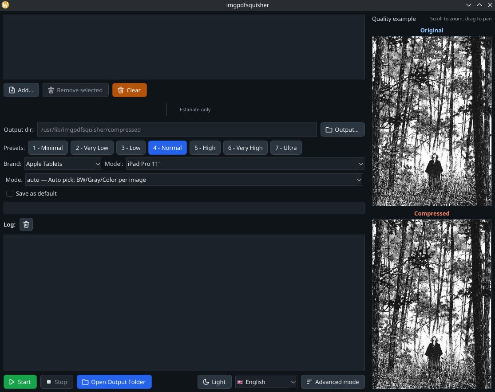

# Imgpdfsquisher [](https://opensource.org/licenses/MIT)

**Imgpdfsquisher** is a Python application for efficiently reducing PDF file sizes by optimizing high-resolution images. It provides both a user-friendly GUI and a powerful command-line interface.



## Features

- **Intelligent compression**: Automatic image type detection and optimization
- **Multiple device profiles**: Pre-configured settings for tablets, smartphones, e-readers
- **Batch processing**: Process multiple PDF files simultaneously
- **GUI and CLI modes**: Choose your preferred interface
- **Quality presets**: From minimal to ultra-high quality compression
- **Multi-language support**: Available in 11 languages

## Quick Start

### GUI Mode
Simply run the application to open the graphical interface:
```bash
python gui_app.py
```

### CLI Mode (```py manga_compressor.py --help```)

```bash
usage: manga_compressor.py [-h] [--files PDF [PDF ...]] [--file-list PATH]
                           [--device {phone,tablet_7,tablet_10,tablet_12,ereader,laptop,desktop}]
                           [--mode {auto,bw,grayscale,color}] [--quality 1-100] [--max-colors-power P]
                           [--max-colors N] [--workers N] [--ram-limit PERCENT] [--out-dir OUT_DIR]
                           [--tmp-dir TMP_DIR] [--suffix SUFFIX] [--default] [--verbose]
                           [input_pdf] [output_pdf]

Compress PDF manga by re-encoding images for a target device

positional arguments:
  input_pdf             Input PDF file to compress
  output_pdf            Output compressed PDF file or +suffix for auto naming

options:
  -h, --help            show this help message and exit
  --files PDF [PDF ...]
                        Batch mode: list of input PDF files to compress
  --file-list PATH      Path to a text file containing one PDF path per line (batch mode)
  --device {phone,tablet_7,tablet_10,tablet_12,ereader,laptop,desktop}
                        Target device - determines resolution and optimizations (default: tablet_10)
  --mode {auto,bw,grayscale,color}
                        Compression mode - 'auto' automatically detects the best type (default: auto)
  --quality 1-100       JPEG quality (1=minimum, 100=maximum) - affects final size (default: 20)
  --max-colors-power P  Palette size as power of two (P). 1=>2, ..., 24=>16,777,216. Overrides --max-colors if
                        given.
  --max-colors N        Maximum colors (legacy). Will be clamped to a power of two in [2..16,777,216]. Default:
                        256
  --workers N           Parallel workers for processing - more workers = faster but more RAM (default: auto)
  --ram-limit PERCENT   RAM limit percentage - controls how much memory to use (default: 75%)
  --out-dir OUT_DIR     Directory where compressed PDFs will be written (default: ./compressed)
  --tmp-dir TMP_DIR     Directory for temporary image extraction (default: ./tmp)
  --suffix SUFFIX       Suffix to append to output filenames (e.g., _compressed). Use '+_x' style also
                        supported.
  --default             Save current arguments as defaults for future runs
  --verbose, -v         Detailed logging for debugging and progress monitoring

Examples
    # Basic (auto output to ./compressed)
    python manga_compressor.py INPUT.pdf +_compressed

    # Custom device and quality
    python manga_compressor.py INPUT.pdf OUTPUT.pdf --device tablet_10 --mode auto --quality 75

    # Batch processing
    python manga_compressor.py --files a.pdf b.pdf c.pdf --out-dir compressed
    python manga_compressor.py --file-list list.txt --suffix _phone

Notes
    - Output directory defaults to ./compressed (auto-created)
    - --suffix can be given as +_name to auto-name per input
    - --max-colors-power P => number of colors = 2^P (1..24)
    - Sensible defaults are loaded from ~/.manga_compressor_defaults.json if saved

Devices
    Full and up-to-date list is maintained here:
    https://github.com/pierspad/imgpdfsquisher/blob/main/assets/devices.json

Modes
    auto         Automatically picks BW, Grayscale or Color per image for best size/quality
    bw           Pure black/white (1-bit PNG) — best for line art and scanned B/W manga
    grayscale    8-bit grayscale JPEG — for pages without significant colors
    color        Full-color JPEG — for color pages/covers
```

## Installation

### From Source
1. Ensure you have Python 3.13+ installed
2. Clone the repository:
   ```bash
   git clone https://github.com/pierspad/imgpdfsquisher.git
   cd imgpdfsquisher
   ```
3. Install dependencies:
   ```bash
   pip install -r requirements.txt
   ```

### For Arch Linux (AUR)
```bash
yay -S imgpdfsquisher
# or
paru -S imgpdfsquisher
```

## Contributing
Pull requests are welcome! We especially appreciate help with:
- Translations to additional languages
- Packaging for Windows/macOS and other Linux distributions
- Bug fixes and feature improvements

For major changes, please open an issue first to discuss your ideas.

## AI Disclosure
This project was developed with the assistance of Large Language Models, used to support code writing and documentation.

## License
This project is licensed under the MIT License – see the [LICENSE](LICENSE) file for details.
